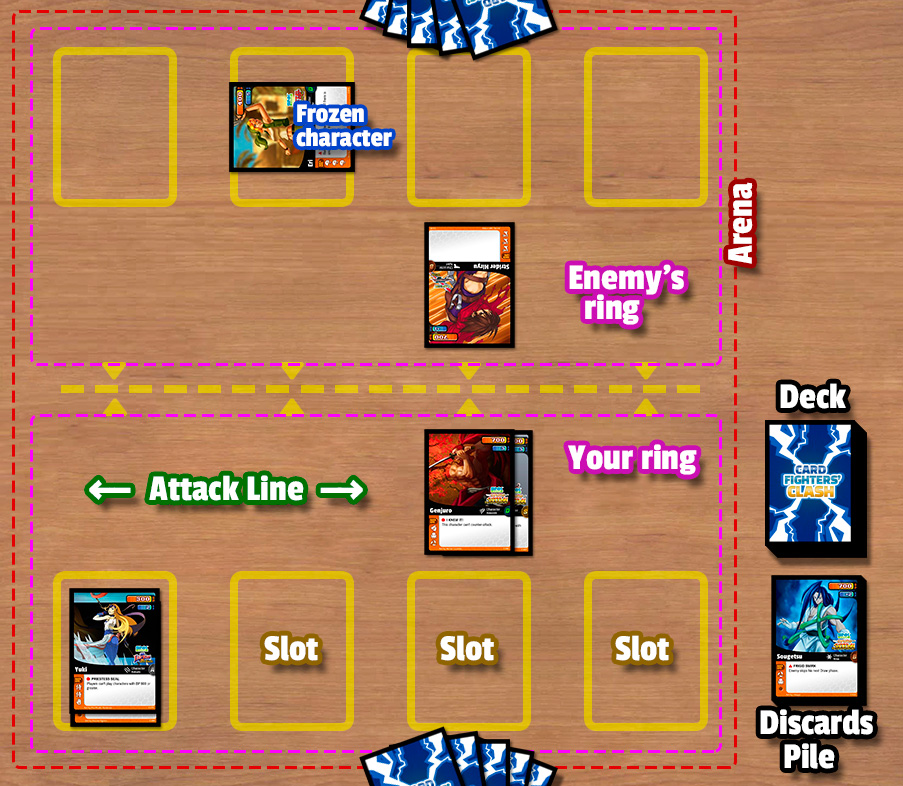

# Card Fighters' Clash Rulebook
This document is designed for people who want to start learning the rules and gameplay of Card Fighters' Clash. ~~For a more advanced set of rules and further explanations, please see the [Comprehensive rules](CFC-CompRules.html) document.~~

(To change the font size of the document, press Ctrl++ or Ctrl+- or Ctrl+Mouse Wheel.)

## Introduction
Card Fighters' Clash (we will refer to it as CFC) is a card game for two players based on SNK Playmore’s video game [SNK vs. Capcom Card Fighters' Clash 2 Expand Edition](http://neogeo.freeplaytech.com/svc-2/). Players try to defeat each other in a battle playing characters from Capcom and SNK Playmore video games. Characters have unique abilities that have impact in the game, and their KI energy can be used to play Action cards and Reaction cards to add more effects to the battle.

Players start the game (in CFC every game is a battle!) with a deck of 50 cards and an initial amount of 3000 **HP** (Hit Points or player's life). A deck may contain any number of Character, Action or Reaction cards, but it can't have more than three copies of any single card with the same name. Each player shuffles his deck and draws an initial hand of 5 cards, and then they are ready to fight.

In their respective turn, players draw cards from his deck, play cards from his hand and attack the opponent (in CFC we refer to an opponent as an *enemy*) with the characters he has in play. Then the enemy has the opportunity to counter-attack with his characters or by playing Reaction cards.

The battle ends when a player's HP (Hit Points or player's life) drops to 0 or less —that is when dealt damage by a character or by the effect of a card. But also a player can lose the battle if he runs out of cards in his deck. So be ready to strike hard and block enemy's attacks, and you will have a chance to win the battle!

Round 1, start!

## Contents
<!-- toc -->

## The Game Board

The game board of CFC has two different zones: the Game Area (also called **Arena**) where the players play their cards, and the Piles Zone where the card stacks are (the Deck , the Discards Pile and the Removed Pile).

The Arena is divided into two parts, one for each player, called the **Ring**. The Ring is where the players places their character cards, always in an empty slot. In a regular CFC game, each Ring has four slots, that means that players can play up to four characters by placing the cards in an empty slot.

When a player attacks with their characters, these cards are placed in the Attack Line by moving them one space forward (but without invading the other player's ring). If the other player blocks an attack (he does a counter-attack) with a character, he moves that card to its Attack Line in front of the attacking card.

At the end of a turn, character cards are moved back to their corresponding slot.

### Deck
Players need a deck of 50 cards to play CFC. A deck can contain any type of card but with the following limitation: **it can't have more than three copies of any single card with the same name** (*for example, a deck can contain three cards named "Akuma" and another three cards named "Shinjin Akuma"*).

When a player draws a card, he must draw from the top of his deck (unless an effect says the opposite).

### Discards Pile
When a character is **KO'ed** (that is, its Battle Points lowers to 0 or by an effect) it's moved from a Ring to its controller Discard Pile , faced up.
Action cards and Reaction cards go to the Discard Pile as well, after their effects are resolved.

Any player may look at a Discards Pile, but the order of the cards can't be changed.

### Removed Pile
Some effects may send cards to the Removed Pile. Cards in this pile are considered out of the game to any effect.

Removed cards are kept face up and may be examined by any player at any time.

### Hand
Cards held by each player are called the **Hand**. When starting a battle, players draw 5 cards from their deck.

There's no limit on the number of cards a player can have in his hand.

## The Cards
By playing cards players can bring into the battle powerful fighters and effects to defeat the opponent.

### Anatomy of a Card

1. **Battle Points (BP)**. It represents a character's attack power and its strength. When a character is dealt damage, its BP is reduced by that number of damage points.
   If the BP lowers to zero, that character is KO'ed and goes to the discard pile.
2. **Soul Points (SP)**. It represents Ki energy in battles. Players can spend SP to play cards and to make United Attacks.  
   When a player plays a card, he gains the SP listed in that card. If the SP is a negative value, then the player must spend that amount from his SP or that card can't be played.
3. **Publisher and Team**. These are the name of the video game where a character appeared (second logo) and that game publisher (first logo).
4. **Card name**.
   The icon on the left represents the card subtype.
5. **Type and Subtype**. The upper line is the card type (Character, Action or Reaction), and the lower line is the card subtype. Only Characters have a subtype.  
6. **Rarity**. The letter and the color indicates the rarity of the card and its power.  
   **D** Very common.  
   **C** Common.  
   **B** Uncommon.  
   **A** Rare; very powerful, balanced, and/or great ability.  
   **S** Very rare, unusual ability.
7. **Text box**. This is where a card’s rules appears, which explains the effects it has in the game. Character cards have an ability symbol (▲, ■ or ●) and an ability name at the beginning of the text, printed in bold.  
   Below the rules text it can appear an italicized text (the flavour text) that adds some description of the CFC world. It has no effect on game play.
8. **Back-ups**. The list and number of subtypes with whom a character can be backed up. Every icon represents a card subtype. Only Characters can have back-ups, up to three.
9. **Information line**. Here is shown the illustration credit and the collector number within a set.
10. **Expansion symbol**. This symbol indicates which set the card is from.

### Card Types
A card has one type, that tells when it can be played and what happens to the card after it's played.

#### Character

Characters are cards that represent a character from a video game, and they are placed into an empty slot of your ring. They can attack and deal damage to an enemy, or they can protect and battle against attacking characters.

Some characters have abilities, represented by an ability symbol (▲, ■ or ●) followed by the ability name in bold.

Character cards have a SP value that is used when played. If it is 0 or more, you gain that amount of SP. If the SP is a negative, then you must pay that cost to play the card.

Only one character card can be played per turn.

When you play a character, the turn it enters the ring it cannot attack and you can't activate its ■ ability.

#### Action

Action cards offers a variety of effects, like special powers or events that can help in a battle. You can play them only in the Main phase of your turn.

Action cards have a cost: a number of SP (usually negative) a player must spend to play the card. After it has been played, its effects are applied immediately and the card is put into the discard pile.

There is no limitation in the number of Action cards a player can play in his turn.

#### Reaction

Reaction cards are like Action cards but that can be only played during an enemy's Counter-attack phase, and only if that enemy is attacking you. After it has been played, its effects are applied immediately and the card is put into the discard pile.

Reaction cards have a cost, a number of SP (usually negative) a player must spend to play that card.

There is no limitation in the number of Reaction cards a player may play.

## The Abilities
Some characters may have an special effect (called *Ability*), which is represented by an ability type (symbols ▲, ■ or ●) followed with the ability name, at the beginning of the rule text.

Every type of ability tells in which moment of the game the ability can be activated.

Once an ability is activated, its effect applies immediately, and it applies only once.

### ▲ Ability
▲ ability are activated when the character enters the ring.

### ■ Ability
■ abilities can be activated only in your Main phase. When it is activated the character enters the freeze state.

Frozen characters and characters that just entered the ring cannot activate a ■ ability in that turn.

### ● Ability
● abilities are always active as long as that character is on the ring.

Whenever a character with a ● ability takes part in a United Attack, that ability is nullified until the end of the turn.

<blockquote>
<h3>The Golden Rule of Battle</h3>

Whenever a card’s rule text directly contradicts the game rules, the card takes precedence.

</blockquote>

## Back-ups
You can attach cards from your hand on characters in your ring to raise its power. By doing so you are **backing-up** the character in your ring.

To back-up a character, choose a card in your hand which subtype matches one those listed in the back-up section of the character card. Then place the card below that character.

Each character has a maximum number of back-ups, equal to the number of subtypes icons in its Back-ups list. Subtype icons indicate the compatible cards that can be used to back-up that character, and only one subtype per icon.  
*__Example:__ Red Arremer's back-ups list shows one Vampire icon and two Zombie icons. That means that Red Arremer can be backed-up exactly by one Vampire card and two Zombie cards.*

The character receiving a back-up raises its BP by 300, regardless of the back-up character's BP.

Characters that just entered the ring and frozen characters can't receive back-ups.

Players can only back-up once per turn.

Characters used for back-up are not considered to be in the ring. If a backed-up character leaves the ring, all their back-ups cards are discarded.

## Attacking and Blocking
The primary way to defeat your opponents is to attack with your characters to drop their HP down to 0. Each of your character is a powerful fighter that may give you the victory!

### Attack
Players can attack with any number of characters in their ring. If an attacking characters is not countered, it deals damage equal to its BP to defending enemy.

A character can attack if it's unfrozen, and only if it was on your ring when the turn began. Then the attacking character is moved one space forward to place it into the Attack Line.

Usually characters attack alone unless you decide to do an United Attack.

#### United Attack
Attacking characters can join their BP to do a more powerful attack. This called a United Attack, where two or three characters attack together as a single entity that does one single attack.

United Attack have a cost depending on the number of characters involved in the attack, that you may pay after choosing the characters. Double United Attack (two characters) costs 5 SP. Triple United Attack (three characters) costs 10 SP.

When choosing the characters you must decide the order -which character goes first in the attack.

The total BP of the characters in a United Attack is considered when dealing damage. If the attack is countered and the total BP of the attacking characters is higher than the BP of the character that counters, this BP difference is dealt as damage to the enemy (piercing damage).

If a United Attack is countered, enemy character deals damage to each attacking character, in ordered sequence, until it is KO'ed or all participants in the United Attack are KO'ed.

### Counter-attack (Block)
A counter-attack happens when defending player counters (blocks) an attack with an unfrozen character in his ring.

A character can only counter-attack one attack. An attack can only be countered by one single character.

Damage is dealt simultaneously between attacking characters and countering characters. Each character is dealt damage equal to the other character's BP.

## The Players
CFC is designed for two players, each of whom has a customized deck of cards.

### HP
The Hit Points represents a player's life. Each player starts the game with 3000 HP.

When a player is dealt damage, he loses that much HP.
A player loses the battle when his HP drops to 0 or less.

### SP
The Soul Points represents a player's Ki energy. SP can be spend to pay the cost of playing cards with a negative SP value, or to pay the cost of United Attacks.

SP can never drop to less than 0. If you don't have enough SP to play a card, then you cannot.

## Game Structure
Each game (also called *Battle*) consists of a number of turns. Players take turns in sequence until one of the players is declared as winner.

The player that is taking his turn is called the *active player*.

### Parts of the turn
Each turn is composed of a set of different parts or *phases*. Whenever you enter a new phase, any ● abilities that happen during that phase are triggered and its effects apply.

1. Activate phase
2. Draw phase
3. Main phase
4. Attack phase
5. Counter-attack phase
6. End phase
7. Cleanup phase

#### 1. Activate phase
All characters in your ring are unfrozen.  
Any ability that happens "At the beginning of your turn" will trigger.

#### 2. Draw phase
You draw a card from your deck.  
The player who goes first will skip his Draw phase during their first turn.  
If you cannot draw cards form yout deck during this phase, you lose the game.

#### 3. Main phase
You can do any of the following actions in any order:

- Play up to one Character card in any empty slot of your ring.
- Back-up up to one character in your ring.
- Activate ■ abilities.
- Play any number of Action cards.

#### 4. Attack phase
You can attack with any number of your unfrozen characters to a single enemy.

#### 5. Counter-attack phase
If active player attacks with one or more characters, the Counter-attack phase is activated. If he does not attack, then Counter-attack phase is skipped.

Enemy can play Reaction cards.
 
Enemy decides which, if any, of his unfrozen characters will counter-attack the attacking characters. Then damage (if any) is dealt to characters and/or defending player.

#### 6. End phase
Characters that attacked this turn are frozen. Any character in the Attack Line is moved back to its original slot.  
Any ability that happens "At the end of your turn" will trigger.

#### 7. Cleanup phase
When this phase ends, your turn ends and next player's turn begins.

## Glossary

__Become Another Card__
When a card becomes another card (this is, it is transformed), all of the card's properties are replaced by the other card's properties. If the card is a character, the BP is replaced by the other card BP (even if that character has received damage). Any back-up on the card is discarded.

The current state of the transformed card does not change (fresh, freeze, etc.), but all effects applied on the card are terminated.

If a transformed card goes to a pile (deck, discard pile or removed pile), it is transformed back to its original card.

__Copy Ability__
To copy an ability from a character and give it to another character. Any existing abilities of the target character are replaced with the copied ability.

__Draw a Card at Random__
Shuffle your deck, then look through the top of it until you reveal a card of the selected type. If you do, put that card into your hand. Then shuffle your deck again.

__Give Ability__
See *Steal Ability*.

__Freeze__
A character in a "freeze" state (or *frozen*) can't attack, counter-attack or activate ■ abilities.

__Fresh__
A character that has just entered the ring in your turn.

__KO__
Whenever a character's BP lowers to zero, that character is KO'ed and it is placed into the discard pile.

__To KO__
To move a character from the arena to its controller's discard pile.

__Lose Ability__
To remove an ability from a character.

__Mimic__
To copy an ability or effect from a card and then resolve it. Once resolved, it ceases to exist.

__Nullify__
Some effects nullifies the abilities of the cards on the ring. Nullified abilities can't be activated.

__Piercing Damage__
If the total BP of the attacking character(s) is higher than the BP of the character that counters, this BP difference is dealt as damage to the enemy.

__Steal Ability__
To remove an ability from a character and give it to another character. Any existing abilities of the target character are replaced with the new one.

__Steal SP__
When you steal SP from an enemy, that enemy loses an amount of SP and you gain that same amount.

__Swap Abilities__
The abilities between two character are interchanged. Both abilities are copied from one character and given to the other at the same time.

__Trash__
To put cards from the top of a player's deck into his or her discard pile.

__Unfreeze__
When a character leaves the "freeze" state. See *Freeze*.

## Additional Links
Source code: https://github.com/raohmaru/CFC
Open an issues: https://github.com/raohmaru/CFC/issues
Changelog: https://github.com/raohmaru/CFC/blob/master/CHANGELOG.md
